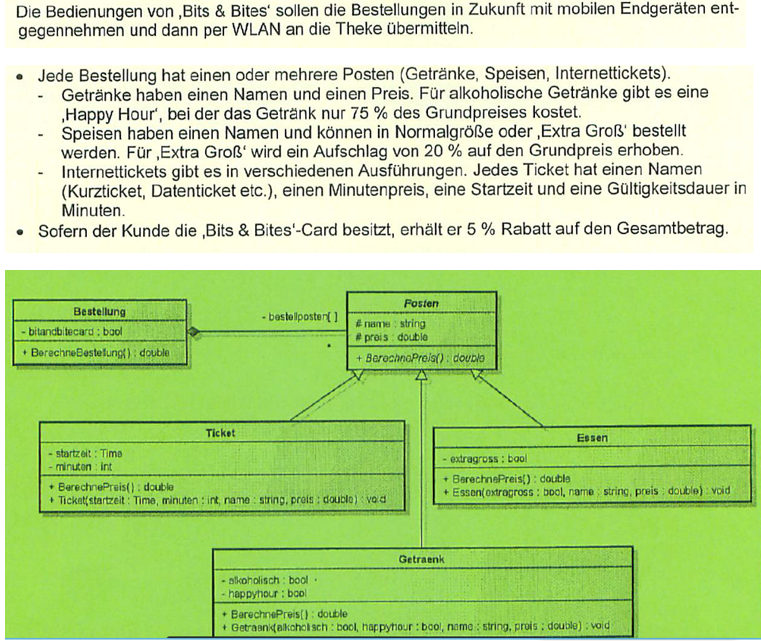

# Projektbeschreibung


Sie arbeiten als IT-Experte bei einem Softwarehaus, das Kassen- und Bestellsysteme für die Gastronomie entwickelt. Ihr Kunde ist das Internetcafé **„Bits & Bites"**, das neben Getränken und Speisen auch zeitbegrenzte Internetzugänge anbietet.


## Aufgabe 1 (Basis)

Sie sollen den Kern der Bestellsoftware entsprechend dem folgenden Klassendiagramm programmieren.



### 1.1

Implementieren Sie die Klassen `Bestellung`, `Posten`, `Getraenk`, `Essen` und `Ticket` in einer *an Ihrer Schule gelehrten Programmiersprache*. Die Attribute und Methoden haben die im Folgenden angegebenen Bedeutungen.

#### Klasse Posten (abstrakt)

| Attribut/Methode | Bedeutung |
|---|---|
| `name` | Bezeichnung des Postens (z. B. „Cola", „Pizza Margherita", „Kurzticket"). |
| `preis` | Grundpreis des Postens in Euro. Bei Tickets ist dies der **Minutenpreis**. |
| `BerechnePreis` | Abstrakte Methode. Liefert den tatsächlich zu zahlenden Preis des Postens. |

#### Klasse Getraenk

| Attribut/Methode | Bedeutung |
|---|---|
| `alkoholisch` | Gibt an, ob es sich um ein alkoholisches Getränk handelt. |
| `happyhour` | Gibt an, ob das Getränk während der Happy Hour bestellt wurde. |
| `Getraenk` | Initialisiert die Attribute mit den übergebenen Werten. |
| `BerechnePreis` | Liefert 75 % des Grundpreises, wenn das Getränk alkoholisch ist **und** während der Happy Hour bestellt wurde, sonst den Grundpreis. |

#### Klasse Essen

| Attribut/Methode | Bedeutung |
|---|---|
| `extragross` | Gibt an, ob die Speise in der Größe „Extra Groß" bestellt wurde. |
| `Essen` | Initialisiert die Attribute mit den übergebenen Werten. |
| `BerechnePreis` | Liefert bei „Extra Groß" den Grundpreis zuzüglich 20 % Aufschlag, sonst den Grundpreis. |

#### Klasse Ticket

| Attribut/Methode | Bedeutung |
|---|---|
| `startzeit` | Uhrzeit, ab der das Ticket gültig ist (in C#: `TimeOnly` oder `DateTime`). |
| `minuten` | Gültigkeitsdauer des Tickets in Minuten. |
| `Ticket` | Initialisiert die Attribute mit den übergebenen Werten. |
| `BerechnePreis` | Liefert Minutenpreis × Gültigkeitsdauer. |

#### Klasse Bestellung

| Attribut/Methode | Bedeutung |
|---|---|
| `bitandbitecard` | Gibt an, ob der Kunde die „Bits & Bites"-Card besitzt. |
| `bestellposten` | Die Posten der Bestellung. |
| `BerechneBestellung` | Liefert die Summe der Preise aller Posten. Besitzt der Kunde die „Bits & Bites"-Card, werden 5 % Rabatt auf den Gesamtbetrag gewährt. |

> **Hinweis:** Das Klassendiagramm legt nicht fest, wie Posten in die Bestellung gelangen. Ergänzen Sie dafür eine geeignete Möglichkeit (Etwa eine Methode, die ungefähr so aussieht: `PostenHinzufuegen(Posten posten)` – An dieser wäre auch denkbar, dass mit einer `Fabrikmethode` gearbeitet wird, d. h. `PostenHinzufuegen` nimmt nur die essentiellen Argumente entgegen (nicht ein Posten als Ganzes), um sich dann selbst um die Erzeugung des Postens zu kümmern.

### 1.2

Schreiben Sie ein Testprogramm (Konsole oder `xUnit`) für die nachfolgenden Testfälle. Geben Sie die Beträge jeweils mit zwei Nachkommastellen aus.

| Testfall | Erwartetes Ergebnis |
|---|---|
| Getränk „Cola", 3,00 €, nicht alkoholisch, Happy Hour | 3,00 € |
| Getränk „Bier", 4,00 €, alkoholisch, keine Happy Hour | 4,00 € |
| Getränk „Bier", 4,00 €, alkoholisch, Happy Hour | 3,00 € |
| Essen „Pizza", 8,50 €, Normalgröße | 8,50 € |
| Essen „Pizza", 8,50 €, Extra Groß | 10,20 € |
| Ticket „Kurzticket", 0,05 €/min, Start 14:00 Uhr, 60 Minuten | 3,00 € |
| Bestellung **ohne** Card: Bier (Happy Hour) + Pizza (Extra Groß) + Kurzticket | 16,20 € |
| dieselbe Bestellung **mit** Card | 15,39 € |
| Bestellung ohne Posten | 0,00 € |

---


## 2. Erweiterung: Konsolenanwendung als Prototyp

Die Geschäftsführung von „Bits & Bites" möchte das System möglichst bald im Café ausprobieren. Als **erster Prototyp** dient eine Konsolenanwendung. Mittelfristig ist eine **WPF-Oberfläche** (oder **.NET Maui**) für die Tablets der Bedienungen geplant.

Baue auf den bereits implementierten und getesteten Klassen – dem **Domänenmodell** – eine Konsolenanwendung mit Menüführung zur Aufnahme einer Bestellung auf.

### Architekturvorgabe: Das Domänenmodell muss die Konsole überleben

Da die Konsolen-Oberfläche später durch WPF ersetzt wird, gilt:

- **Kein `Console.WriteLine` / `Console.ReadLine` in den Domänenklassen.** `Posten`, `Getraenk`, `Bestellung` usw. berechnen und verwalten – sie geben nichts aus und lesen nichts ein. Die gesamte Ein- und Ausgabe liegt in der Konsolenschicht (z. B. in `Program.cs` oder einer eigenen Klasse `KonsolenMenue`).
- Achte darauf, die Wiederverwendbarkeit als zentrales Qualitätsmerkmal der Software zu fördern. Leit- bzw. Kontrollfrage: *„Könnte ich diese Klasse unverändert in einer WPF-Anwendung verwenden?"* 
- Bezug: **Separation of Concerns** und **Single-Responsibility-Prinzip** (das S in SOLID) – eine Klasse hat genau *einen* Grund, sich zu ändern. Ändert sich die Oberfläche, darf sich die Preisberechnung nicht ändern müssen.
- Denkbar: Lege Domänenmodell und Konsolenanwendung in **zwei Projekten** an (Klassenbibliothek/Konsolenprojekt + Konsolenprojekt mit Projektverweis). Spätere Host- oder Testanwendungen können dann das Domänenmodell durch den Projektverweis wiederverwenden.

### Menüpunkte

```
=== Bits & Bites – Bestellung ===
1. Getränk hinzufügen
2. Essen hinzufügen
3. Internetticket hinzufügen
4. Posten entfernen
5. Bestellung anzeigen
6. Bits & Bites-Card an/aus
7. Bestellung an Theke übermitteln
8. Beenden
```

- **Hinzufügen (1–3):** Das Programm fragt die jeweils benötigten Angaben ab (Name, Preis, alkoholisch/Happy Hour, Extra Groß, Startzeit/Minuten).
- **Entfernen (4):** Zeigt die Posten nummeriert an; der Nutzer wählt die Nummer des zu entfernenden Postens.
- **Anzeigen (5):** Gibt die Bestellung als „Bon" aus – je Posten eine Zeile mit Name und berechnetem Preis, darunter ggf. der Card-Rabatt und der Gesamtbetrag.
- **Card (6):** Schaltet den Card-Status der Bestellung um und zeigt den neuen Status an.
- **Übermitteln (7):** Simuliert die Übermittlung an die Theke durch eine Ausgabe des Bons mit Zeitstempel. Danach beginnt eine neue, leere Bestellung.
- **Fehleingaben** (Buchstaben statt Zahlen, ungültige Menüpunkte, nicht existierende Postennummern) dürfen das Programm **nicht** zum Absturz bringen.

## Optionale Erweiterungen

Die folgenden Erweiterungen sind unabhängig voneinander. Wähle nach Interesse aus – Qualität geht vor Menge.

### a) Clean Code mit Enums

- Ersetze magische Zahlen (`0.75`, `1.2`, `0.95`) durch sprechend benannte Konstanten.
- Führe ein Enum für die Menüpunkte ein, damit der `switch` im Hauptmenü lesbar wird:

```csharp
public enum MenuePunkt { GetraenkHinzufuegen = 1, EssenHinzufuegen, TicketHinzufuegen, PostenEntfernen, Anzeigen, CardUmschalten, Uebermitteln, Beenden }
```

- **Bestellstatus mit Zustandsdiagramm:** Eine Bestellung durchläuft die Zustände `Offen → Uebermittelt → Bezahlt`. Modelliere diese Zustände als Enum und zeichne ein **UML-Zustandsdiagramm**. Posten dürfen nur im Zustand `Offen` hinzugefügt oder entfernt werden.

### b) Fehlerbehandlung mit Exceptions

Setze im Domänenmodell gezielte Leitplanken – die Konsolenschicht fängt die Ausnahmen ab und gibt eine verständliche Meldung aus:

- Ein **negativer Preis** oder eine **Gültigkeitsdauer ≤ 0** löst eine `ArgumentOutOfRangeException` aus (Validierung im Konstruktor bzw. in der Property).
- Ein **leerer Name** löst eine `ArgumentException` aus.
- Das Hinzufügen eines Postens zu einer **bereits übermittelten Bestellung** löst eine `InvalidOperationException` aus (setzt a) voraus).
- Benutzereingaben werden in der Konsolenschicht mit `int.TryParse` / `double.TryParse` oder mit `try-catch` (`FormatException`) abgesichert.

> Faustregel: Eine Exception signalisiert einen **Programmier- bzw. Aufruferfehler**, kein normales Geschäftsereignis.

### c) Erweiterbarkeit: Open-Closed-Prinzip

Das Café möchte demnächst **Gutscheine** als neuen Postentyp anbieten (negativer Betrag, z. B. „10-€-Gutschein").

- Ergänze die Klasse `Gutschein`. Prüfe anschließend: **Musste dafür `Bestellung.BerechneBestellung()` geändert werden?** Wenn nein, hast du das Open-Closed-Prinzip (das O in SOLID) und Polymorphie richtig umgesetzt. 
- Achtung: Ein Gutschein darf den Gesamtbetrag nicht unter 0 € drücken.

### d) Rabatte als Strategie (Strategy Pattern)

Aktuell ist der Card-Rabatt fest in `BerechneBestellung()` verdrahtet. Die Geschäftsführung plant aber weitere Aktionen (z. B. „Studententag: 10 %", „Mittagsmenü").

- Definiere ein Interface `IRabattStrategie` mit einer Methode `double WendeAn(double betrag)`.
- Implementiere z. B. `KeinRabatt`, `CardRabatt` und `StudentenRabatt`. Die `Bestellung` erhält ihre Strategie von außen (über den Konstruktor oder eine Property) – **Dependency Injection**.
- Bezug: **Open-Closed-Prinzip** (neue Rabatte ohne Änderung an `Bestellung`) und **Dependency-Inversion-Prinzip** (das D in SOLID: `Bestellung` hängt von einer Abstraktion ab, nicht von einer konkreten Rabattregel).
- Bonus: Die Happy Hour wird nicht mehr per `bool` übergeben, sondern anhand der Uhrzeit ermittelt (z. B. 17–19 Uhr). Wo gehört diese Logik hin?

### e) Erweiterte Anzeige und Statistik (LINQ)

- **Ticket:** Ergänze eine berechnete Property `Endzeit` (Startzeit + Minuten) und zeige sie im Bon an.
- **Tagesstatistik** über alle übermittelten Bestellungen: Tagesumsatz, durchschnittlicher Bestellwert, Anzahl verkaufter Posten je Typ, meistverkaufter Posten. Entwickle diese Logik imperativ oder mittels `Linq`-Methoden wie `Sum`, `Average`, `Count`, `Where`, `OfType<Getraenk>()`, `GroupBy`.
[siehe dazu: LINQ-Grundkurs](https://www.linkedin.com/learning/linq-grundkurs)

### f) Echte Unit-Tests mit xUnit

Die Testfälle aus 1.2 werden bisher nur per Sichtprüfung der Konsolenausgabe kontrolliert. Sichere sie stattdessen mit **automatisierten xUnit-Tests** in einem eigenen Testprojekt ab.

- Ein Test pro Testfall aus 1.2, zusätzlich Tests für die erwarteten Exceptions aus b) mit `Assert.Throws<...>()`.
- **Achtung bei Gleitkommazahlen:** `0.05 * 60` ist in `double` nicht exakt `3.0`. Vergleiche daher mit Genauigkeit: `Assert.Equal(3.0, ticket.BerechnePreis(), 2);`
- Weiterführend: Für Geldbeträge ist in C# der Datentyp `decimal` die bessere Wahl. Stelle das Domänenmodell auf `decimal` um – die Tests zeigen sofort, ob dabei etwas kaputtgeht.
- Mit Strategien aus d) lässt sich `Bestellung` besonders gut testen.

### g) Persistenz: Bestellungen speichern und laden

Übermittelte Bestellungen sollen beim Beenden gespeichert und beim Start wieder geladen werden (z. B. für die Tagesstatistik aus e).

- **Repository-Pattern:** Definiere ein Interface `IBestellRepository` mit `Speichern(List<Bestellung>)` und `Laden()`. Die Konsolenschicht kennt nur das Interface – ob dahinter XML, JSON, CSV oder später eine SQLite-Datenbank steckt, ist austauschbar (**Dependency-Inversion-Prinzip**).
- **XML mit `XmlSerializer`** (`System.Xml.Serialization`):
  - Serialisiert werden nur **öffentliche** Properties mit `get` **und** `set` sowie Klassen mit einem **öffentlichen parameterlosen Konstruktor**. Private Felder wie im Klassendiagramm werden ignoriert.
  - Für die abstrakte Basisklasse muss der Serializer die Unterklassen kennen: `[XmlInclude(typeof(Getraenk))]`, `[XmlInclude(typeof(Essen))]`, `[XmlInclude(typeof(Ticket))]` über `Posten`.
  - Für die Posten-Sammlung eignet sich `List<Posten>` besser als ein Array.
  - `TimeOnly` wird je nach .NET-Version vom `XmlSerializer` nicht unterstützt – im Zweifel `DateTime` verwenden.
- **Alternative JSON mit `System.Text.Json`:** `JsonSerializer.Serialize(...)` / `Deserialize<...>(...)`. Für Polymorphie werden die Unterklassen an der Basisklasse bekannt gemacht: `[JsonDerivedType(typeof(Getraenk), "getraenk")]` usw.
- Die Serialisierer verlangen öffentliche Setter – das kollidiert mit der Kapselung aus dem Klassendiagramm. Die Lösung besteht in der Anlegung eigener Datenklassen, sogenannte `DTOs` (Datentransferobjekte). 

### Leitfragen zur Selbstkontrolle (SOLID)

| Prinzip | Kontrollfrage für dein Projekt |
|---|---|
| **S**ingle Responsibility | Enthält die Domänenklasse Konsolen-Ein-/Ausgabe? Macht `Program.cs` alles allein? |
| **O**pen-Closed | Kann ein neuer Postentyp oder Rabatt ergänzt werden, ohne bestehende Klassen zu ändern? |
| **L**iskov Substitution | Funktioniert `BerechneBestellung()` mit *jedem* Posten korrekt – auch mit dem Gutschein? |
| **I**nterface Segregation | Sind die Interfaces klein und zweckgebunden? |
| **D**ependency Inversion | Hängen `Bestellung` und Menü von Interfaces (bzw. Abstraktionen) ab statt von konkreten Klassen (Rabatt, Repository)? |


## Abgabebedingungen

- **Frist:** Freitag, 8:00 Uhr
- **Format:** Lösung als ZIP-Archiv einreichen (ohne `bin`- und `obj`-Ordner)
- **Namensschema:** `Nachname-Vorname-BitsAndBites.zip` (z. B. `Mueller-Florian-BitsAndBites.zip`)
- **Pflichtumfang:** Aufgabe 1 und Aufgabe 2. Die optionalen Erweiterungen sind freiwillig; gib in einer kurzen `README.md` an, welche umgesetzt wurden.
- **Portfolio:** Das Projekt kann zusätzlich im persönlichen GitHub-Repository veröffentlicht werden.
